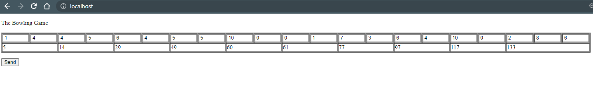

# BowlingGame

How to start the game?

Clone project from github:
git clone https://github.com/O-cpu/BowlingGame.git

Run:
./gradlew bootRun

Open website:
http://localhost/

Result:

Aufgabenbeschreibung
Bitte erstelle ein Programm, welches aus den Punktzahlen einzelner Würfe beim Bowling die
Gesamtpunktzahl eines Spieles ermitteln kann.

Bitte stelle uns dein Ergebnis per GitHub oder Email (dann als Zip-File des Quellcodes) zur
Verfügung. Zur Eingabe und Ausgabe reicht ein einfaches Text-Interface. Du kannst dafür eine
Programmiersprache deiner Wahl nutzen. Ein Spieler ist ausreichend.

Zeitlich solltest du nicht mehr als 2-3 Stunden aufwenden. Solltest du dann nicht fertig sein, schicke
uns auch gerne den unfertigen Stand.

Wir erwarten hier keine perfekt ausgearbeitete Lösung, sondern wollen herausfinden, wie du arbeitest
und die Aufgabe angehst. Wenn du nicht fertig wirst, hilft uns z.B. ein Ausblick, was deine nächsten
Schritte wären.

Rückfragen kannst du gerne an mich stellen. Technische Fragen leite ich weiter.
Hier die Spielregeln für das Bowling-Game:

Das Spiel besteht aus 10 Frames. In jedem Frame hat der Spieler zwei Versuche (Rolls) und kann bis
zu 10 Pins umzuwerfen. Die Punktzahl pro Frame setzt sich aus der Anzahl der umgeworfenen Pins
und weiteren Boni zusammen. Diese Boni ergeben sich aus Spares und Strikes.

Ein Spare liegt vor, wenn der Spieler alle 10 Pins in einem Frame umgeworfen hat. Der Bonus für
dieses Frame ist die Anzahl der Pins, die im direkt darauf folgenden Roll umgeworfen werden. Ein
Beispiel ist Frame 3 im obigen Bild. Der Score ist 10 (Anzahl der umgeworfenen Pins) plus einen
Bonus von 5 (Die Anzahl der Pins im ersten Roll der 4. Frame).

Ein Strike liegt vor, wenn der Spieler alle 10 Pins im ersten Versuch umwirft. Der Bonus hierfür ist die
Anzahl der umgeworfenen Pins der nächsten zwei Rolls.

Im zehnten Frame darf ein Spieler, der einen Spare oder einen Strike erreicht einen zusätzlichen Roll
spielen, um das Frame zu beenden. Es können aber nicht mehr als 3 Rolls im letzten Frame gespielt
werden.

Wir wünschen dir viel Erfolg und viel Spaß bei der Aufgabe!
